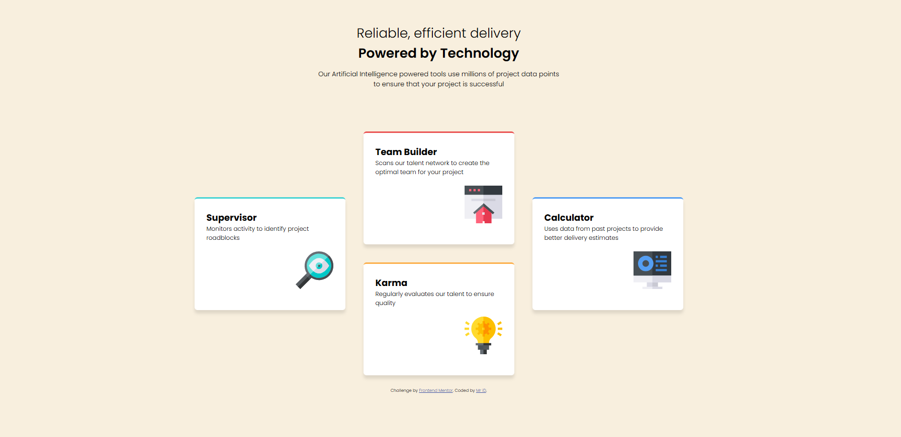

# Frontend Mentor - Four card feature section solution

This is a solution to the [Four card feature section challenge on Frontend Mentor](https://www.frontendmentor.io/challenges/four-card-feature-section-weK1eFYK). Frontend Mentor challenges help you improve your coding skills by building realistic projects. 

### Screenshot

### Links

- Solution URL: [Click Me](https://github.com/iD024/frontend-06)
- Live Site URL: [Click Me](https://id024.github.io/frontend-06/)

## Author

- Frontend Mentor - [MriD](https://www.frontendmentor.io/profile/id024)
